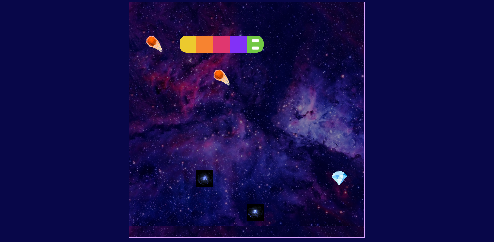

# WORMHOLE
## Snake... in space!

💎 Diamonds == ✅  
💫 Portals == ⁉️  
☄️ Asteroids == 💀  
🌟 Stars == 👻  

Use the arrow keys to help Yurlungur the snake capture the goods, but be careful not to run into obstacles… or yourself!
### [Play the demo here!](https://danuscript.github.io/WORMHOLE/)
WORMHOLE is a simple twist on the classic Snake game, with the addition of Einstein-Rosen bridges for even more fun (relatively speaking).

All code was co-authored by [@StevenCYTong](https://github.com/stevencytong) and [@danuscript](https://github.com/danuscript). WORMHOLE was built with Vanilla JS/CSS/HTML, and the demo site was deployed straight from the files in this repository via GitHub Pages.
### Known Issues:
- Occasional sprite clipping
